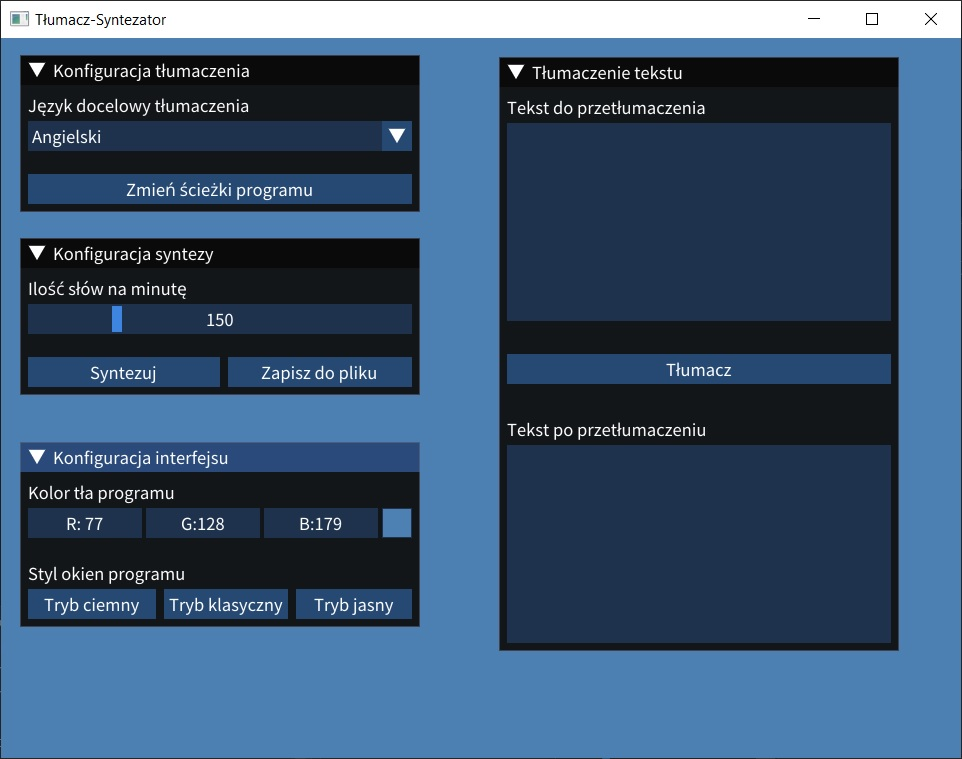

# Translator-Synthesizer
## Description
My programming project for programming classes at the university. The assumption on this project was to create high-speed translator in C++ and extend it with speech synthesizer with a Python library pyttsx3, which uses Microsoft API for speech synthesis.
## Limitations
As this app was purposed to be only a training project, it has several limitations. For example translation quality is not suitable enough for being used in practise, app can run only on Windows for now, but there's a place for improvements. Changing the translation mechanism for more precise one and the synthesis for a platform-independent solution could make this project a decent cross-platform offline translator.
## User interface
Interface was created with Dear ImGui implementation in GLFW and Vulkan. My previous attempts to create UI were done with UWP, which caused many problems with logic implementation. I've had a limited time to finish the project, so I've decided to rewrite the project for ImGui. I'm aware that's not the best solution for creation of end user targeted apps, but I wanted to try it.
## App screenshot

